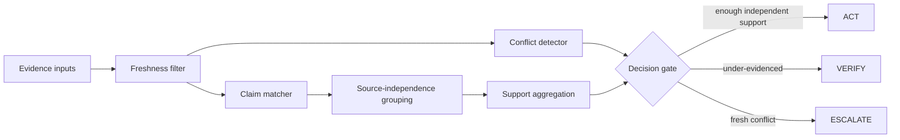

# Architecture

## Data model

Each evidence item carries:

- `claim`
- `source`
- `confidence`
- `observed_at`
- `ttl_seconds`
- optional `independent_group`

The independent group is intentionally separated from the display source. Two different tools may still depend on the same upstream database and therefore should not automatically count as independent.

## Decision rule

The prototype acts only when:

1. fresh evidence supports the target claim;
2. the support score reaches the configured threshold;
3. the minimum number of independent source groups is satisfied; and
4. no fresh conflicting claim exists.

A fresh conflict causes escalation. Under-evidenced non-conflicting cases request verification.
